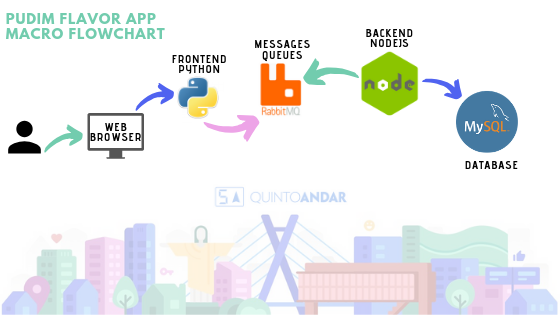
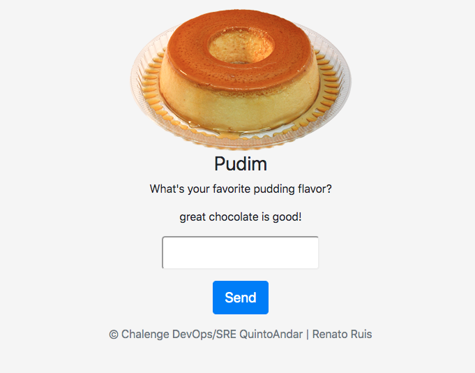

# PUDIM FLAVOR

Is a simple application based on micro services.
Read the information carefully :)

See the Macro FlowChart.




---

First, I want to thank you for participating in the challenge, I hope that I will be chosen to move on to the next step.

---
### Changelog
 - Created Dockerfiles from Backend (NodeJS)
 - Created Dockerfiles from Frontend (Python)
 - Stack Docker compose with:
    - Mysql Server
    - PHPMyAdmin (Admin mysql UI)
    - RabbitMQ (With UI)
    - Backend 'Hello-node''
    - Frontend 'Hello-python'
    - Refactory on front :)
  
### It is possible to increase, when there is a little more time, with:
 - Put the services in separate repositories
 - Integrate with some CI tool
 - Connect to an external cluster of RabbitMQ
 - Connect to an external MySQL Server
 - Many others features...

 ---
 ## How to deploy this application in localhost

 ### Requirements
  - Internet Access without proxy
  - Docker (See [here](https://docs.docker.com/install/) how to install )
  - Docker Compose (See [here](https://docs.docker.com/compose/install/) how to install )
  - Host Linux
  - Bash

Assuming that it meets all the requirements and is already with the code ready.

1 - Set variables in DevOps/.env

2 - Run the command below
```
DevOps/bootstrap.sh
```

3 - Please wait until you see the message below.
```
DONE: We are ready!
FRONT:      http://localhost:8000
PHPMYADMIN: http://localhost:8100/phpmyadmin (User: hello Pass: hello)
RABBIT UI:  http://localhost:15672 (User: rabbitmq Pass: rabbitmq)
```

4 - Access the http://localhost:8000 and see the Pudim Flavor App



----
## Support
If there is any problem, please contact me
renatoruis@gmail.com 
11 99462-1377