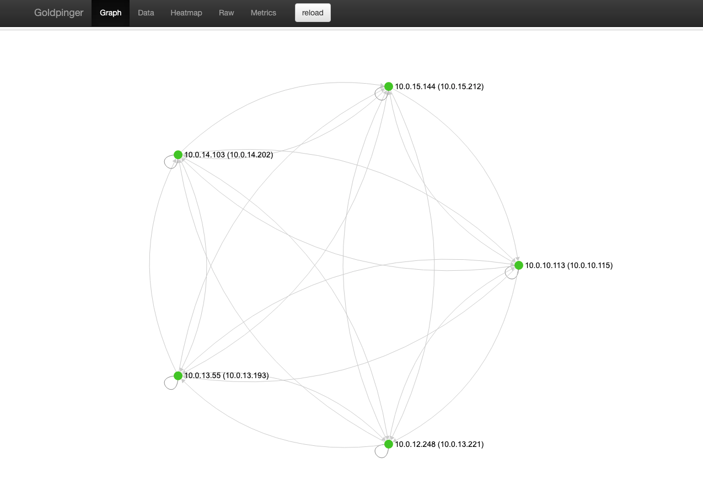
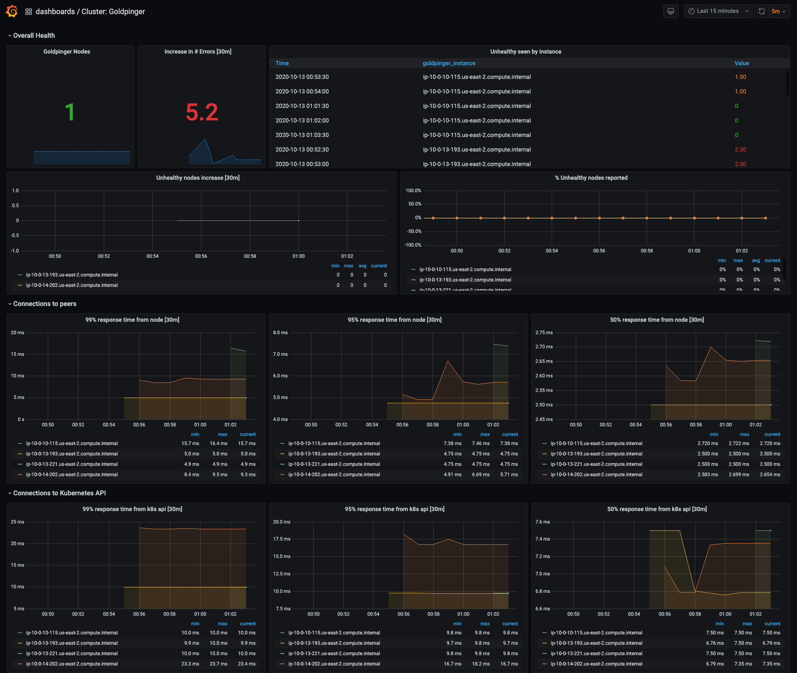
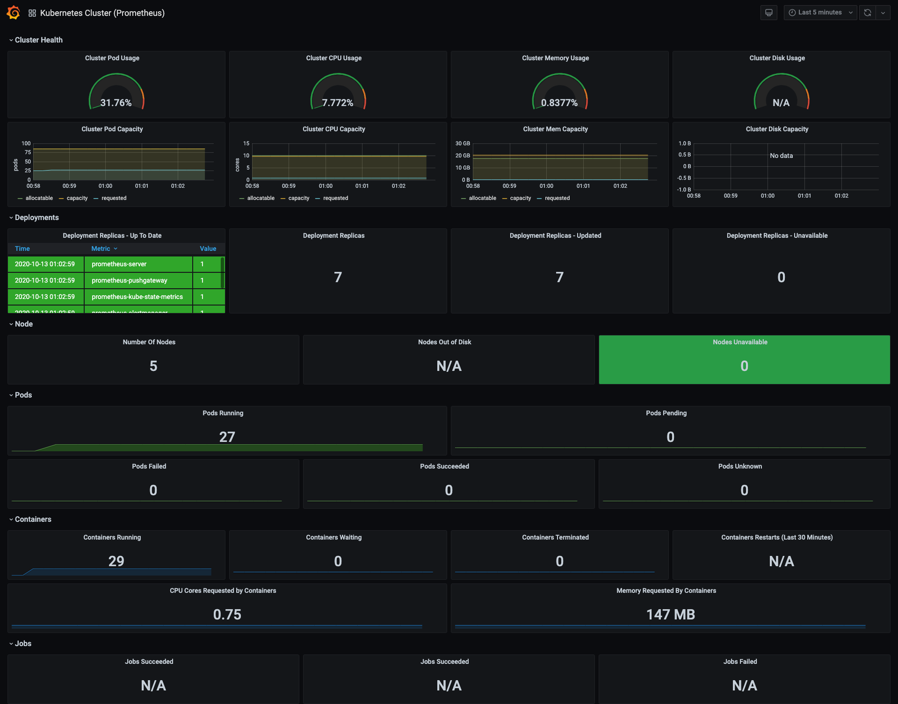
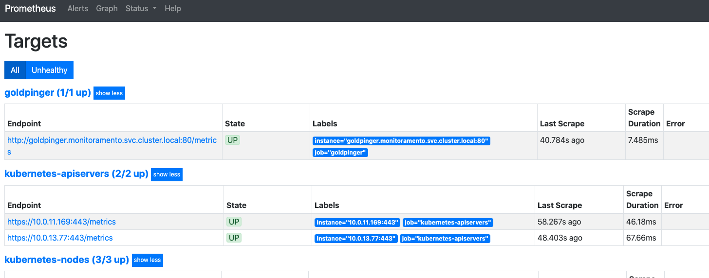
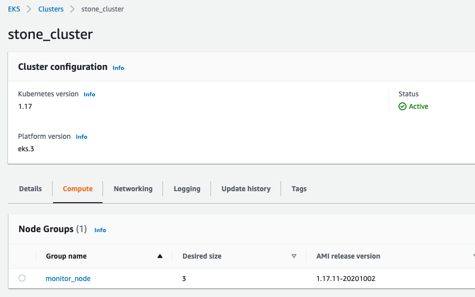
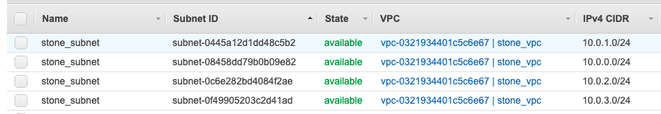

<br><br>
# Desafio Stone
Leia todo o Readme antes de iniciar o uso.

Usando somente Terraform:
- Criar um cluster de K8S de alta disponibilidade
- Configurar uma instância de Prometheus rodando no K8S
- Encontrar uma solução de monitoramento de rede do Kubernetes. Só queremos saber se todos os nós estão conseguindo conversar entre si e qual é a latência
- Configurar a solução de monitoramento de rede no K8S
- Coletar as métricas usando o Prometheus
----
# Soluções abordadas
- __*Criar um cluster de K8S de alta disponibilidade*__
    - Usei modulo da comunidade para provisionar recursos necessários (VPC, Subnets e etc) e o próprios cluster EKS
      - [Modulo VPC](https://github.com/terraform-aws-modules/terraform-aws-vpc) e o [Módulo EKS](https://github.com/terraform-aws-modules/terraform-aws-eks)
  
- __*Configurar uma instância de Prometheus rodando no K8S*__
    - Usando Provider HELM e [CHART da comunidade](https://github.com/prometheus-community/helm-charts/tree/main/charts/prometheus)

- __*Encontrar uma solução de monitoramento de rede do Kubernetes. Só queremos saber se todos os nós estão conseguindo conversar entre si e qual é a latência*__
    - Crei uma solução baseada em um script python para monitorar a latencia entre nodes (apresento pessoalmente)
    - Também Encontrei uma solução "pronta" chamada [GOLDPINGER](https://github.com/bloomberg/goldpinger) que faz exatamente isso verificar se os nós estão se falando e ainda fornece uma interface de facil visualizão, métricas para o Prometheus e um Dashboard para o Grafana.
- __*Configurar a solução de monitoramento de rede no K8S*__
    - Usei os recursos disponibilizado com o mesmo chart do prometheus 
- __*Coletar as métricas usando o Prometheus*__
    - Prometheus configurado e coletando Metricas do cluster.
<br>

## Requisitos
 - [Terraform](https://learn.hashicorp.com/tutorials/terraform/install-cli)
 - [AWS cli ](https://docs.aws.amazon.com/cli/latest/userguide/cli-chap-install.html)
 - [Kubectl](https://kubernetes.io/docs/tasks/tools/install-kubectl/)
 - [aws-iam-autenticator](https://docs.aws.amazon.com/eks/latest/userguide/install-aws-iam-authenticator.html)

---
<br>

## Executando
Exporte suas variaveis AWS
```
export AWS_ACCESS_KEY_ID=XXXXXXXXXXX
export AWS_SECRET_ACCESS_KEY=XXXXXXXXXXXXX
```
Edite o arquivo variables.tf conforme seu ambiente
```
terraform init
terraform plan
terraform apply
```
Após todos os recursos provisionados será gerado um arquivo chamado kubeconfig-stone.yaml. você pode usá-lo para acessar todos os recursos do cluster caso necessário.

<br>

## Use o script abaixo para gerar as urls locais e acessar os serviços.
```
./acessos.sh
```
<br>

# **Screenshots**

**GOLDPINGER**



<br><br>

**GRAFANA**



<br>


<br><br>

**PROMETHEUS**



<br><br>

**CLUSTER**



<br><br>

**VPC**



<br><br>
---
## **TODO:**
 - Adicionar Ingress
 - Adicionar Zona Route53 e CNAME apontando para LB criado pelo ingress
 - SSL

<br>

Qualquer dúvida entre em contato comigo **renatoruis@gmail.com**
