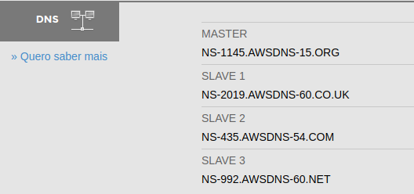
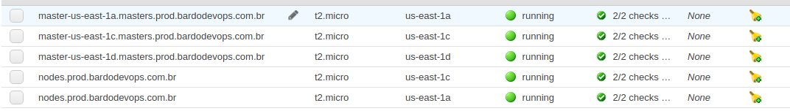
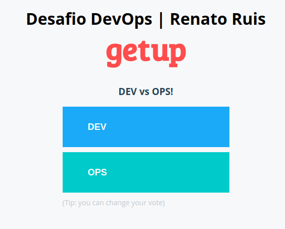
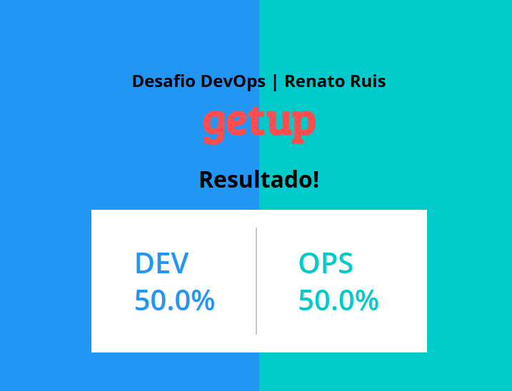
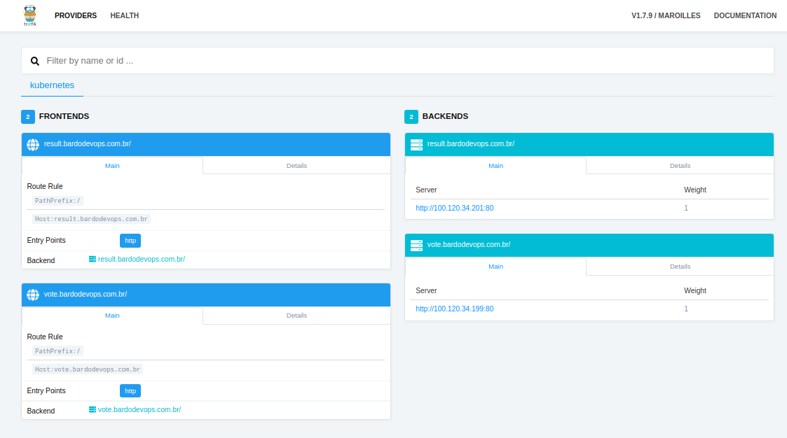

# <p style='color: #ff4c4d'> **Desafio K8S**

Desafio para o processo seletivo de DevOps Engineer na 

[](https://getupcloud.com/pt-br/)

Veja [aqui](o-desafio.md) o desafio proposto pelo [João](https://www.linkedin.com/in/juniorjbn/)

---
***Atenção:*** Esta é a versão mais simples e rápida, para ver uma versão com um pouco mais de complexidade use a branch master.

## <p style='color: #ff4c4d'> **Considerações**
_"Nada se cria tudo se transforma"_ Lavoisier

Com isso quero dizer que **usei/copiei** sim muitas referências na nossa querida internet segue aqui os devidos Créditos/Referências/Documentações:

- [Terraform](https://www.terraform.io/)
- [VPC WITH TERRAFORM](https://ryaneschinger.com/blog/kubernetes-aws-vpc-kops-terraform/)
- [KOPS](https://github.com/kubernetes/kops)
- [AWS CLI](https://aws.amazon.com/pt/cli/)
- [Docker](https://www.docker.com/)

**Opnião:** Hoje com os clusters gerenciados dos clouds providers, eles nos garantem mais segurança, menos trabalho, Escalonamento mais simples e uma curva de aprendizado menor. Acredito que não seja uma boa idéia gerenciar os clusters de K8S desta forma.

---
## <p style='color: #ff4c4d'> **Requisitos**

- **Clonar este repositório**

- **Cloud Provider**
    - AWS
- **Uma conta com as permissões necessárias para o KOPS e configurada no seu AWS CLI**

- **Um domínio registrado**

- **Ferramentas** (Devidamente configuradas)
    - Terraform
    - KOPS
    - AWS CLI (Configurado)
    - Docker
    - kubectl
    - jq


Obs: Todo o cenário foi executado a partir de uma distribuição "Debian like" (no meu caso usei [Deepin Linux](https://www.deepin.org/pt/) com [Oh My ZSH](https://ohmyz.sh/)) 

---
## <p style='color: #ff4c4d'> **HANDS ON**
Edite o arquivo [variables.tf](./VPC/variables.tf) com os dados para o seu Cluster

Após isso vamos criar a VPC, Subnets e Bucket
```
cd resources
terraform init
terraform apply

```

Pegue o output "name_servers" do dns e configure no seu domínio, no meu caso usei o [registro.br](https://registro.br)

Minha saída do Terraform

```
Apply complete! Resources: 2 added, 0 changed, 0 destroyed.

Outputs:

availability_zones = [
    us-east-1a,
    us-east-1c,
    us-east-1d
]
cluster_name = prod.bardodevops.com.br
instances_master_type = t2.micro
instances_node_type = t2.micro
kops-store = s3://bardodevops.com.br-kops-store
name = bardodevops.com.br
name_servers = [
    ns-1145.awsdns-15.org,
    ns-2019.awsdns-60.co.uk,
    ns-435.awsdns-54.com,
    ns-992.awsdns-60.net
]
public_zone_id = Z29ONBW16LFJLR


```

Meu registro no [registro.br](https://registro.br)



### <p style='color: yellow'>**Aguarde propagar as configurações do domínio!**
use este comando para checar se já propagou "dig bardodevops.com.br ANY"

Exporte as variáveis que vamos usar com o KOPS

```
export NAME=$(terraform output cluster_name)
export KOPS_STATE_STORE=$(terraform output kops-store)
export ZONES=$(terraform output -json availability_zones | jq -r '.value|join(",")')
export ZONE=$(terraform output public_zone_id)
```

Vamos criar a configuração do cluster 
```
kops create cluster \
--master-size $(terraform output instances_master_type) \
--node-size $(terraform output instances_node_type) \
--master-zones $ZONES \
--zones $ZONES \
--topology private \
--dns-zone $ZONE \
--networking calico \
${NAME}

```
Vamos aplicar/subir a configuração do cluster
```
kops update cluster ${NAME} --yes
```
Aguarde as instancias iniciarem


Configure o kubectl para acessar o cluster
```
kops export kubecfg ${NAME} --yes
```

---
## Instalando o traefik

Execute o comando abaixo.

```
kubectl apply -f https://raw.githubusercontent.com/renatoruis/my-traefik/master/deploy/rbac.yaml
kubectl apply -f https://raw.githubusercontent.com/renatoruis/my-traefik/master/deploy/deployment.yaml

```
Use o comando abaixo para ver o endereçoç do loadbalance criado, vamos usar este endereço para criar os registros dns da nossa aplicação

```
kubectl get services -n kube-system | grep traefik | awk '{print $4}'
```

---
## Criando os Registros DNS

Edite o arquivo [dns/cnames.json](dns/cnames.json) adicionando os dados do domínio e loadbalance e depois crie os registros com o comando abaixo.

``` 
aws route53 change-resource-record-sets --hosted-zone-id Z29ONBW16LFJLR --change-batch file://./dns/cnames.json
```
---
## Deploy da aplicação
Eu fiz algumas alterações na aplicação.
Para ver a documentação da aplicação clique aqui [voting-app](./voting-app/README.md)

Execute o comando abaixo
```
kubectl apply -f voting-app/k8s-specifications/
```

---
## Endereços da nossa aplicação
TRAEFIK | http://traefik.bardodevops.com.br:8080/dashboard/

VOTE-APP | http://vote.bardodevops.com.br/

RESULT-APP | http://result.bardodevops.com.br/

---
## Features "ainda" não implantadas

- Acesso Administrativo e Desenvolvedor
- Monitoramento
- SSL
- Logs


---
## Screenshots da aplicação




